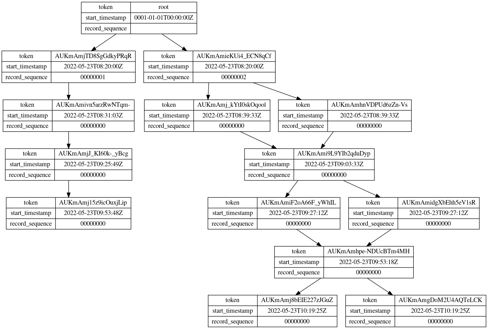

# spanner-change-streams-tail

[](https://github.com/cloudspannerecosystem/spanner-change-streams-tail/actions/workflows/run-tests.yaml) [](https://pkg.go.dev/github.com/cloudspannerecosystem/spanner-change-streams-tail/changestreams)

A handy tool to "tail -f" [Cloud Spanner Change Streams](https://cloud.google.com/spanner/docs/change-streams) on the local machine.

Both GoogleSQL and PostgreSQL database dialects are supported.

## Install

```
go install github.com/cloudspannerecosystem/spanner-change-streams-tail@latest
```

## Usage

```
Usage:
  spanner-change-streams-tail [OPTIONS]

Options:
  -p, --project=  (required)   GCP Project ID
  -i, --instance= (required)   Cloud Spanner Instance ID
  -d, --database= (required)   Cloud Spanner Database ID
  -s, --stream=   (required)   Cloud Spanner Change Stream ID
  -f, --format=                Output format [text|json] (default: text)
      --start=                 Start timestamp with RFC3339 format (default: current timestamp)
      --end=                   End timestamp with RFC3339 format (default: none)
      --visualize-partitions   Visualize the change stream partitions in Graphviz DOT

Help Options:
  -h, -help                    Show this help message
```

## Example

### Simple example

By default, this tool shows the Data Change record in plan text.

```
$ spanner-change-streams-tail -p myproject -i myinstance -d mydb -s mystream
Reading the stream...
2022-05-19 06:49:15.093823 +0000 UTC | INSERT | Players | [{"keys":{"PlayerId":"29"},"new_values":{"Name":"foo"},"old_values":{}}]
2022-05-19 06:49:20.866495 +0000 UTC | DELETE | Players | [{"keys":{"PlayerId":"29"},"new_values":{},"old_values":{"Name":"foo"}}]
2022-05-20 13:44:32.486447 +0000 UTC | UPDATE | Players | [{"keys":{"PlayerId":"23"},"new_values":{"Name":"bar"},"old_values":{"Name":"foo"}}]
...
```

### JSON format

With `-f json` option, you can get the results in JSON.

```
$ spanner-change-streams-tail -p myproject -i myinstance -d mydb -s mystream -f json
Reading the stream...
{"commit_timestamp":"2022-05-19T06:46:12.536575Z","record_sequence":"00000000","server_transaction_id":"NjQxOTE0MDE0MzM1MDQ4NTQ5NQ==","is_last_record_in_transaction_in_partition":true,"table_name":"Players","column_types":[{"name":"PlayerId","type":{"code":"INT64"},"is_primary_key":true,"ordinal_position":1},{"name":"Name","type":{"code":"STRING"},"is_primary_key":false,"ordinal_position":2}],"mods":[{"keys":{"PlayerId":"22"},"new_values":{"Name":"foo"},"old_values":{}}],"mod_type":"INSERT","value_capture_type":"OLD_AND_NEW_VALUES","number_of_records_in_transaction":1,"number_of_partitions_in_transaction":1}
{"commit_timestamp":"2022-05-19T09:45:59.480799Z","record_sequence":"00000000","server_transaction_id":"MTIwNjc4MTEyNTU3NDc1MDk5MjA=","is_last_record_in_transaction_in_partition":true,"table_name":"Players","column_types":[{"name":"PlayerId","type":{"code":"INT64"},"is_primary_key":true,"ordinal_position":1},{"name":"Name","type":{"code":"STRING"},"is_primary_key":false,"ordinal_position":2}],"mods":[{"keys":{"PlayerId":"23"},"new_values":{"Name":"bar"},"old_values":{}}],"mod_type":"INSERT","value_capture_type":"OLD_AND_NEW_VALUES","number_of_records_in_transaction":1,"number_of_partitions_in_transaction":1}
{"commit_timestamp":"2022-05-20T13:45:27.682335Z","record_sequence":"00000000","server_transaction_id":"MTE1NTE3OTU3NzM5MjEyMzkxMzI=","is_last_record_in_transaction_in_partition":true,"table_name":"Players","column_types":[{"name":"PlayerId","type":{"code":"INT64"},"is_primary_key":true,"ordinal_position":1},{"name":"Name","type":{"code":"STRING"},"is_primary_key":false,"ordinal_position":2}],"mods":[{"keys":{"PlayerId":"23"},"new_values":{"Name":"bar"},"old_values":{"Name":"foo"}}],"mod_type":"UPDATE","value_capture_type":"OLD_AND_NEW_VALUES","number_of_records_in_transaction":1,"number_of_partitions_in_transaction":1}
...
```

### JSON format with jq

You can use `jq` command to modify the results.

```
$ spanner-change-streams-tail -p myproject -i myinstance -d mydb -s mystream -f json | jq '{ts:.commit_timestamp, type:.mod_type, table:.table_name}'
Reading the stream...
{
  "ts": "2022-05-20T08:13:45.695039Z",
  "type": "INSERT",
  "table": "Players"
}
{
  "ts": "2022-05-20T08:14:17.668655Z",
  "type": "DELETE",
  "table": "Players"
}
{
  "ts": "2022-05-20T13:46:27.347695Z",
  "type": "UPDATE",
  "table": "Players"
}
...
```

### Start & End timestamp

With `--start` and `--end` options, you can specify the time boundary of the records that be read. Both options must
be [RFC3339](https://datatracker.ietf.org/doc/html/rfc3339) format.

```
$ spanner-change-streams-tail -p myproject -i myinstance -d mydb -s mystream --start='2022-05-19T14:28:00Z' --end='2022-05-19T15:04:00Z'
Reading the stream...
2022-05-19 14:28:50.566943 +0000 UTC | INSERT | Players | [{"keys":{"PlayerId":"29"},"new_values":{"Name":"foo"},"old_values":{}}]
2022-05-19 15:03:07.866495 +0000 UTC | DELETE | Players | [{"keys":{"PlayerId":"29"},"new_values":{},"old_values":{"Name":"foo"}}]
2022-05-19 15:03:28.907391 +0000 UTC | UPDATE | Players | [{"keys":{"PlayerId":"20"},"new_values":{"Name":"abc"},"old_values":{"Name":"foo"}}]
```

### Verbose output

With `-v, --verbose` option, you can get the Heartbeat and Child Partitions records as well. Also, each result includes
the `partition_token` that associates with the change record.

```
$ spanner-change-streams-tail -p myproject -i myinstance -d mydb -s mystream --verbose
Reading the stream...
{"partition_token":"","change_record":[{"data_change_record":[],"heartbeat_record":[],"child_partitions_record":[{"start_timestamp":"2022-05-20T08:23:10.12375Z","record_sequence":"00000001","child_partitions":[{"token":"AUKmAmgw5S0xbORt3X6EPHBTEXRL5H7VVRh1T7I0xeX_M04SnhhFYBOjQuQZ3AHCh6jGc3gsxAqOHRMHyinqts18NY-JY7Ym5fvSoAGouuSmH6Gff1LspwazfdBRY8_G1enbeBuQNa8b1AEG_KsuhFJCdsr6_Q","parent_partition_tokens":[]}]}]}]}
{"partition_token":"","change_record":[{"data_change_record":[],"heartbeat_record":[],"child_partitions_record":[{"start_timestamp":"2022-05-20T08:23:10.12375Z","record_sequence":"00000002","child_partitions":[{"token":"AUKmAmi65l6TU-0EGTTAj9zLPBU_aJJ1Jsy3JLIkWIH-SSb_nXfTb6X4CLmTQFSkZj-QL_NiGi3p0jGZNQZ8C1WF01GkgvIQ7Qaf4XFxVqSBgPuXBzdpLiye58fmj_Dz2lnV_LYTtPgQcdvOUGJU","parent_partition_tokens":[]}]}]}]}
{"partition_token":"AUKmAmgw5S0xbORt3X6EPHBTEXRL5H7VVRh1T7I0xeX_M04SnhhFYBOjQuQZ3AHCh6jGc3gsxAqOHRMHyinqts18NY-JY7Ym5fvSoAGouuSmH6Gff1LspwazfdBRY8_G1enbeBuQNa8b1AEG_KsuhFJCdsr6_Q","change_record":[{"data_change_record":[],"heartbeat_record":[{"timestamp":"2022-05-20T08:23:20.123938Z"}],"child_partitions_record":[]}]}
{"partition_token":"AUKmAmi65l6TU-0EGTTAj9zLPBU_aJJ1Jsy3JLIkWIH-SSb_nXfTb6X4CLmTQFSkZj-QL_NiGi3p0jGZNQZ8C1WF01GkgvIQ7Qaf4XFxVqSBgPuXBzdpLiye58fmj_Dz2lnV_LYTtPgQcdvOUGJU","change_record":[{"data_change_record":[],"heartbeat_record":[{"timestamp":"2022-05-20T08:23:20.123904Z"}],"child_partitions_record":[]}]}
...
```

### Visualize partitions

With `--visualize-partitions` option, you can get the visualized partitions in Graphviz DOT format. You also need to
specify `--start` and `--end` options to specify the time bound for visualization.

```
$ spanner-change-streams-tail -p myproject -i myinstance -d mydb -s mystream --start="2022-05-23T17:20:00+09:00" --end="2022-05-23T19:20:00+09:00" --visualize-partitions
Reading the stream and analyzing partitions...

digraph {
  node [shape=record];
  "AUKmAmidgXbEhh5eV1sR" [label="{token|start_timestamp|record_sequence}|{{AUKmAmidgXbEhh5eV1sR}|{2022-05-23T09:27:12Z}|{00000000}}"];
  "AUKmAmi9L9YIb2qduDyp" [label="{token|start_timestamp|record_sequence}|{{AUKmAmi9L9YIb2qduDyp}|{2022-05-23T09:03:33Z}|{00000000}}"];
  "AUKmAmj15z9icOuxjLip" [label="{token|start_timestamp|record_sequence}|{{AUKmAmj15z9icOuxjLip}|{2022-05-23T09:53:48Z}|{00000000}}"];
  "AUKmAmjTD8SgGdkyPRqR" [label="{token|start_timestamp|record_sequence}|{{AUKmAmjTD8SgGdkyPRqR}|{2022-05-23T08:20:00Z}|{00000001}}"];
  "AUKmAmjJ_KI60k-_yBcg" [label="{token|start_timestamp|record_sequence}|{{AUKmAmjJ_KI60k-_yBcg}|{2022-05-23T09:25:49Z}|{00000000}}"];
  "AUKmAmhpe-NDUcBTm4MH" [label="{token|start_timestamp|record_sequence}|{{AUKmAmhpe-NDUcBTm4MH}|{2022-05-23T09:53:18Z}|{00000000}}"];
  "AUKmAmj8bEIE227zJGuZ" [label="{token|start_timestamp|record_sequence}|{{AUKmAmj8bEIE227zJGuZ}|{2022-05-23T10:19:25Z}|{00000000}}"];
  "AUKmAmgDoM2U4AQTeLCK" [label="{token|start_timestamp|record_sequence}|{{AUKmAmgDoM2U4AQTeLCK}|{2022-05-23T10:19:25Z}|{00000000}}"];
  "root" [label="{token|start_timestamp|record_sequence}|{{root}|{0001-01-01T00:00:00Z}|{}}"];
  "AUKmAmj_kYtI0skOqool" [label="{token|start_timestamp|record_sequence}|{{AUKmAmj_kYtI0skOqool}|{2022-05-23T08:39:33Z}|{00000000}}"];
  "AUKmAmhnVDPUd6zZn-Vs" [label="{token|start_timestamp|record_sequence}|{{AUKmAmhnVDPUd6zZn-Vs}|{2022-05-23T08:39:33Z}|{00000000}}"];
  "AUKmAmiF2oA66F_yWhIL" [label="{token|start_timestamp|record_sequence}|{{AUKmAmiF2oA66F_yWhIL}|{2022-05-23T09:27:12Z}|{00000000}}"];
  "AUKmAmieKUi4_ECN8qCf" [label="{token|start_timestamp|record_sequence}|{{AUKmAmieKUi4_ECN8qCf}|{2022-05-23T08:20:00Z}|{00000002}}"];
  "AUKmAmivn5arzRwNTqm-" [label="{token|start_timestamp|record_sequence}|{{AUKmAmivn5arzRwNTqm-}|{2022-05-23T08:31:03Z}|{00000000}}"];
  "root" -> "AUKmAmieKUi4_ECN8qCf"
  "AUKmAmjTD8SgGdkyPRqR" -> "AUKmAmivn5arzRwNTqm-"
  "AUKmAmieKUi4_ECN8qCf" -> "AUKmAmhnVDPUd6zZn-Vs"
  "AUKmAmi9L9YIb2qduDyp" -> "AUKmAmiF2oA66F_yWhIL"
  "AUKmAmi9L9YIb2qduDyp" -> "AUKmAmidgXbEhh5eV1sR"
  "root" -> "AUKmAmjTD8SgGdkyPRqR"
  "AUKmAmivn5arzRwNTqm-" -> "AUKmAmjJ_KI60k-_yBcg"
  "AUKmAmj_kYtI0skOqool" -> "AUKmAmi9L9YIb2qduDyp"
  "AUKmAmhnVDPUd6zZn-Vs" -> "AUKmAmi9L9YIb2qduDyp"
  "AUKmAmjJ_KI60k-_yBcg" -> "AUKmAmj15z9icOuxjLip"
  "AUKmAmhpe-NDUcBTm4MH" -> "AUKmAmgDoM2U4AQTeLCK"
  "AUKmAmieKUi4_ECN8qCf" -> "AUKmAmj_kYtI0skOqool"
  "AUKmAmiF2oA66F_yWhIL" -> "AUKmAmhpe-NDUcBTm4MH"
  "AUKmAmidgXbEhh5eV1sR" -> "AUKmAmhpe-NDUcBTm4MH"
  "AUKmAmhpe-NDUcBTm4MH" -> "AUKmAmj8bEIE227zJGuZ"
}
```



## Go library

This repository also has `changestreams` package that can be used as a Go library to read the change streams from your
Go application. You can get more details from
the [Godoc](https://pkg.go.dev/github.com/cloudspannerecosystem/spanner-change-streams-tail/changestreams).

Note that `changestreams` package has limited scalability. If you need more scalable, reliable solution, you can use an
official [Dataflow connector](https://cloud.google.com/spanner/docs/change-streams/use-dataflow).

## Disclaimer

Please feel free to report issues and send pull requests, but note that this application is not officially supported as
part of the Cloud Spanner product.
